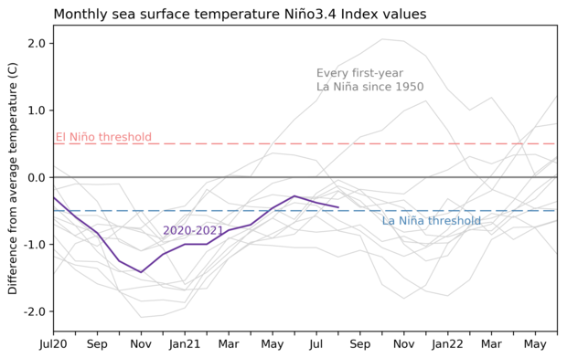

# ENSO Forecast Prediction Web App
The goal of this web application will be to take in use provided data and run it through a set model.

The model will take in input of the PC1 of sea surface temperatures (SST) and the PC1 of ocean heat content (OHC) from the past 18 months. The model will take these two predictors and use them to make a forecast to predict whether we are heading into an El Niño or La Niña event. The forecast will then be displayed back to the user as shown below:

## Instructions to run frontend locally
1. Make sure Node.js is installed
2. Run `npm install` inside the frontend folder
3. Start the web app with `npm run dev`
4. Open http://localhost:5173

## Instructions to run backend locally
1. Move into the backend folder
2. It is recommended to use a venv
3. Run `pip install -r requirements.txt`
4. Run `uvicorn main:app --reload`
