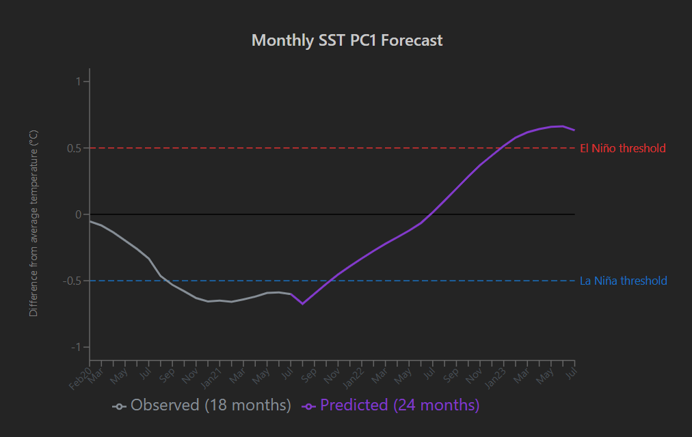
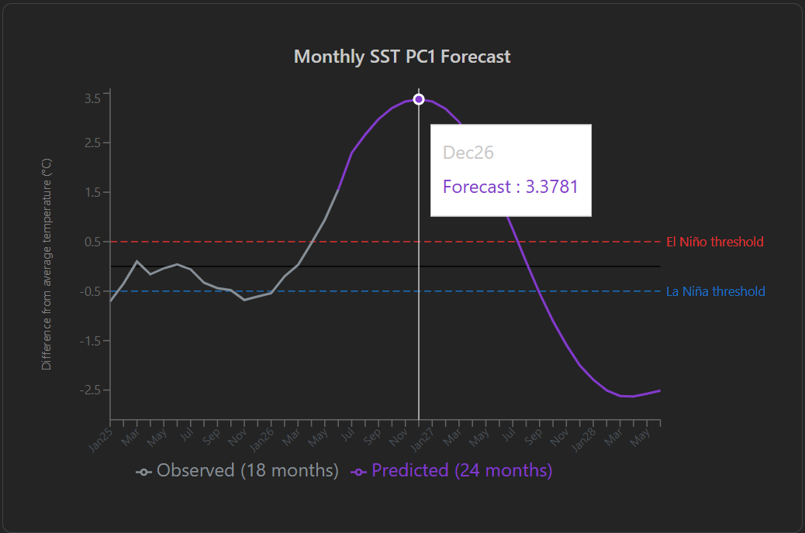

# ENSO Forecast Prediction Web App
This web application provides a user-friendly interface for generating El Niño–Southern Oscillation (ENSO) forecasts using a pretrained deep learning model.

The application accepts user-provided climate data consisting of the principal components (PC1) of sea surface temperature (SST) and ocean heat content (OHC) from the most recent 18 months. These inputs are processed by the forecasting model, which predicts the next 24 months of SST PC1 values.

The resulting forecast is visualized through an interactive chart that displays predicted SST anomalies and highlights potential transitions toward El Niño or La Niña events based on established climate thresholds.

Example forecasts are shown below:

## Instructions to run frontend locally
1. Make sure Node.js is installed
2. Run `npm install` inside the frontend folder
3. Start the web app with `npm run dev`
4. Open http://localhost:5173

## Instructions to run backend locally
1. Move into the backend folder
2. It is recommended to use a venv
3. Run `pip install -r requirements.txt`
4. Run `uvicorn main:app --reload`
