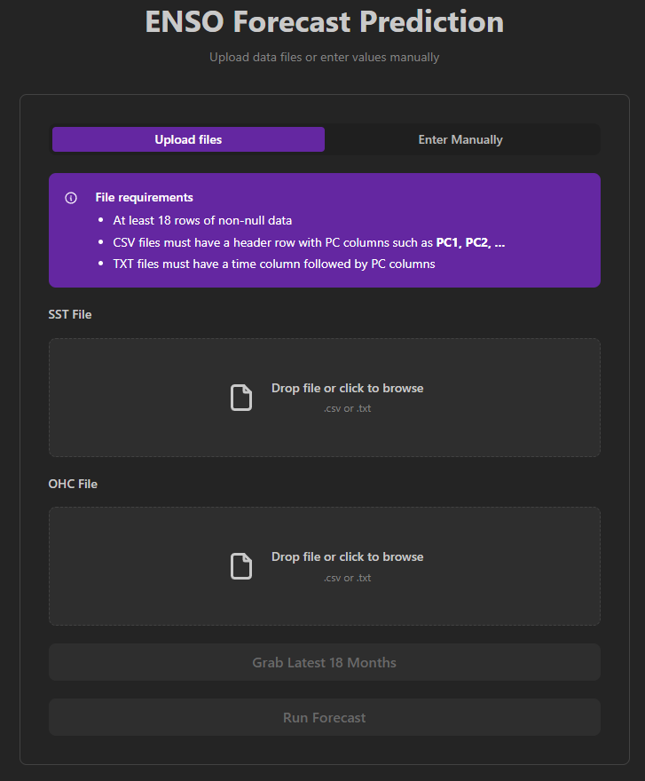
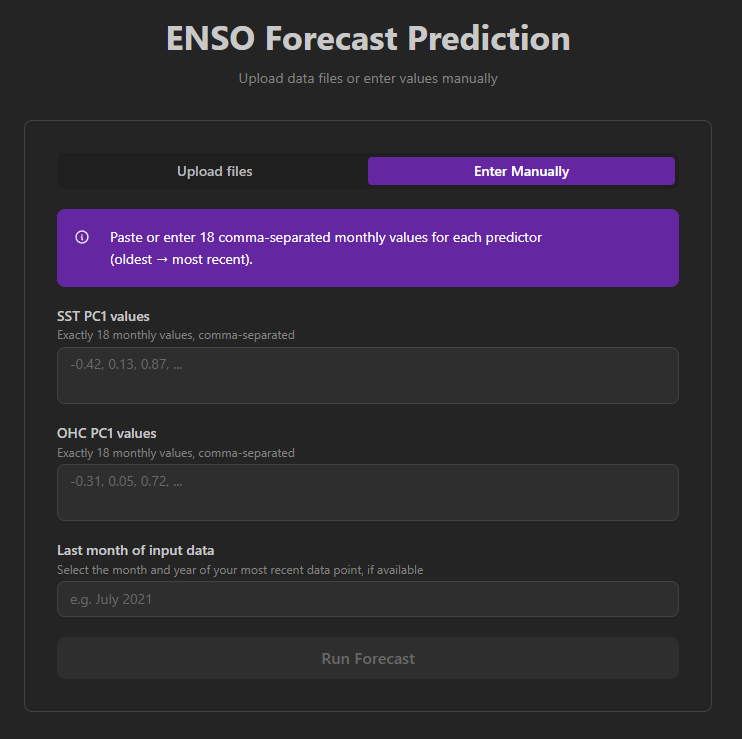

# ENSO Forecast Web App
This web application provides a user-friendly interface for generating El Niño–Southern Oscillation (ENSO) forecasts using a pretrained deep learning model.

## Overview

The web app takes user-provided climate data, specifically the first principal component (PC1) of sea surface temperature (SST) and ocean heat content (OHC) from the most recent 18 months, and produces a 24-month SST PC1 forecast displayed as an interactive chart with El Niño and La Niña thresholds.

## Input Methods

Data can be provided in two ways:

**File Upload:** Upload 2 separate SST and OHC data files in CSV or TXT format. After both files are uploaded the 'Grab Latest 18 Months' button extracts PC1 from each file and aligns the most recent 18 months of overlapping non-null data. A preview table is shown before running the forecast.

**Manual Entry:** Paste or type exactly 18 comma-separated monthly values for each predictor. Select the last month of your input data to generate accurate date labels on the forecast chart.

## Ouput
When the 'Run Forecast' button is pressed, these inputs are processed by the forecasting model, which predicts the next 24 months of SST PC1 values.

The resulting forecast is visualized through an interactive chart that displays predicted SST anomalies and highlights potential transitions toward El Niño or La Niña events based on the established thresholds. These thresholds are 0.5° C above and below the average sea surface temperature respectively.

## Example Forecasts

## Instructions to run locally
Two separate consoles should be used for the frontend and backend.

### Frontend
1. Make sure Node.js is installed
2. Run `npm install` inside the frontend folder
3. Start the web app with `npm run dev`
4. Open http://localhost:5173

### Backend
1. Move into the backend folder
2. It is recommended to use a venv
3. Run `pip install -r requirements.txt`
4. Run `uvicorn main:app --reload`
